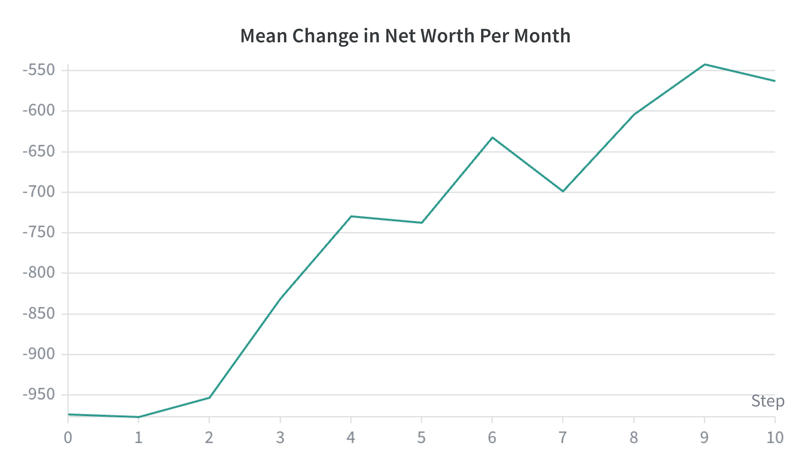

# CropRL: Teaching LLMs to Farm, Trade, and Deceive — A Multi-Agent RL Environment

*OpenEnv Hackathon 2026 — Theme 1 (Multi-Agent) + Theme 2 (Long-Horizon Planning)*

---

## The Environment: A Village Economy in 60 Months

Farming is the oldest sequential decision-making problem in human history. Every season, a farmer faces choices with delayed, uncertain outcomes: what to plant, when to harvest, whether to take a loan, and what to do when the market crashes because every neighbour harvested corn on the same week.

**CropRL** simulates exactly this — a shared Indian village economy spanning **60 months (5 years)**. Up to 8 AI farmers operate simultaneously, each managing a private plot of land, soil health, crop inventory, and finances. They plant, irrigate, harvest, store, speculate, and post to a shared public forum.

The twist that makes this environment genuinely novel: **agents share the same market**, and all sell orders clear in a batch at the end of each month. If all four farmers plant Corn and harvest it in the same month, supply floods the market and the clearing price collapses for everyone.

This one mechanic creates an immediate prisoner's dilemma. Selling alone earns the spot price. Selling together earns 30% of it. But you can't see what your neighbours will do until it's too late — unless you read the forum.

### What Makes It Novel

Most multi-agent RL environments are symmetric games (Prisoner's Dilemma, StarCraft, etc.) with a well-defined Nash equilibrium. CropRL is neither:

- **Single unifying objective, multi-domain complexity.** The reward is a single number — change in net worth — but it implicitly encodes agronomy, market finance, weather forecasting, and game theory. Agents must discover soil conservation, market timing, and coordination *without being told any of these sub-goals exist*.

- **Six crop archetypes with real strategic tension.** Three standard crops (Corn, Wheat, Chickpea) form a soil-economy triangle: Corn is the most profitable but destroys soil nitrogen over time; Chickpea restores nitrogen but earns little. Three "hype crops" (Matcha, Quinoa, Turmeric) follow a four-phase boom-bust cycle (DORMANT → BUILDING → PEAK → COLLAPSING), with tiny market capacities that guarantee a price crash if more than one or two agents pile in.

- **Theory of Mind through a noisy forum.** Agents may post up to two public messages per month. These messages can be truthful coordination signals ("I'm planting wheat, leave corn to me") or deliberate bluffs designed to manipulate neighbours into over-planting a competitor crop.

- **Real physical and financial constraints.** Crops rot in storage after 6 months. Soil nitrogen that reaches zero yields nothing. Compounding loan interest at 8–12% annually means debt taken carelessly in month 5 can bankrupt an agent by month 20. Inflation compounds costs every year.

---

## Why This Environment is Hard, and What We Expect the Agent to Learn

From a pure RL perspective, CropRL stacks every known difficulty on top of each other:

**Long horizon with delayed credit assignment.** The episode is 240+ steps per agent (60 months × 4 action slots each). Planting Corn in month 1 depletes soil nitrogen across the next 12 months, cascading into worse yields in every subsequent cycle. An agent must learn to associate causes with effects separated by dozens of steps.

**Non-stationarity from other agents.** In a 4-agent episode, the clearing price an agent receives for its corn harvest depends on what the other three planted 4 months ago and whether they all chose to sell this month. The environment is non-stationary from each agent's perspective — the optimal action depends on beliefs about others' future actions.

**Partial observability.** Agents can see what their neighbours plant (via the public ledger), but not their cash balance, debt level, soil health, or storage. Forum messages are the only channel for sharing intent — and any message could be a lie.

**A genuine multi-agent dilemma invisible to single-agent benchmarks.** A single-agent version of this game would be substantially easier. The hard part is not farming — it's farming while modelling what four other farmers will do.

A policy that has genuinely *learned* CropRL should exhibit behaviours that were never explicitly programmed:

| Behaviour | Why It Must Be Discovered, Not Programmed |
|---|---|
| **Corn → Chickpea rotation** | Soil nitrogen affects land value in the reward signal; the agent must discover the connection |
| **Hype crop timing** | Enter during BUILDING phase, sell at PEAK before over-supply collapse triggers early crash |
| **Market cartel formation** | Post forum messages to coordinate crop roles and avoid simultaneous harvests |
| **Contrarian positioning** | When neighbours commit to Corn (visible on ledger), pivot to Wheat to exploit the uncontested price |
| **Strategic misinformation** | Post false intent to manipulate competitors, then secretly plant the uncrowded crop |
| **Debt-financed speculation** | Borrow → plant hype crop at BUILDING → sell at PEAK → repay before interest compounds |

None of these strategies have a reward bonus. They emerge because the single net-worth signal correctly penalizes every mistake and rewards every insight, month by month.

---

## The Training Pipeline

Adapting a small LLM to a 60-month environment with sparse terminal rewards is, bluntly, intractable without a thoughtful pipeline. Three techniques work in concert to make it feasible. Importantly, the agent is not trained from scratch: we start from **Qwen 3 0.6B**, a pretrained, instruction-tuned model that already possesses general language understanding and reasoning ability. The pipeline's job is to specialise that existing competence for CropRL through distillation and RL fine-tuning — not to instil it from nothing.

### Stage 1 — Distillation: The Teacher Gives the Student a Head Start

Our student model is **Qwen 3 0.6B**, a pretrained instruction-tuned LLM — it already knows how to follow instructions and reason in natural language. What it lacks is any domain knowledge about farming, market dynamics, or CropRL's specific action format. When presented cold with a 15-action farm dashboard, it produces predominantly invalid actions (−50 penalty each) and random waits, because it has no prior over which action IDs are meaningful in which contexts. Because all trajectories are uniformly bad, the GRPO gradient signal is near-zero — there's no contrast to learn from.

We solve this with a **teacher-student distillation pipeline**:

1. **Teacher generation.** We deploy Qwen 3.6 27B on the `easy_2agent` task to generate 100 episodes of expert trajectories, recording every (observation, action) pair as a standard chat-completion triple.

2. **Student-referenced filtering.** Rather than using a fixed reward threshold, we first run the *untrained 0.6B student* on the same task and measure its baseline return `μ_student`. Teacher trajectories are kept only if they exceed `μ_student` — ensuring the student learns only from demonstrations it couldn't already replicate. A small random sample of below-threshold trajectories is retained as contrast examples for diversity.

3. **SFT with LoRA (all-linear).** The filtered dataset is used to fine-tune the 0.6B model. After SFT, the student knows the action grammar, can parse a farm dashboard, and has internalized basic farming heuristics — without having touched the environment itself.

After SFT, the LoRA weights are merged into the base model. This becomes the starting point for GRPO, and crucially, the reference policy for the KL penalty.

### Stage 2 — Curriculum Learning: Growing the Horizon

Even post-SFT, dropping the student into a full 60-month episode produces high-variance gradients. The model's ability to plan degrades rapidly as the horizon extends — early decisions have too much compound effect to be useful training signal at the beginning.

We implement a **progressive horizon curriculum** during GRPO. The maximum episode length starts at 10 months in iteration 1 and increases by 2 months each iteration, reaching the full 60-month horizon by iteration ~25:

```python
current_max_months = min(60, 10 + iteration * 2)
```

This forces the model to first master short-term consequences (planting, irrigation, harvest timing) before being exposed to the compounding effects of soil degradation, multi-year inflation, and hype crop cycles. The curriculum keeps the training signal dense and the advantage variance manageable throughout.

### Stage 3 — Reward Shaping: Telescoping the Terminal Signal

The primary evaluation metric is terminal profit — a single number after 240 steps. This is the textbook sparse reward problem.

The solution exploits a mathematical identity. Net worth at any step is:

```
NW_t = Cash_t + LandValue_t + GrowingCropValue_t + StoredValue_t − Debt_t
```

Terminal profit is therefore a telescoping sum:

```
Terminal Profit = NW_T − NW_0 = Σ ΔNW_t
```

This is not an approximation — it is exact. We use `ΔNW_t` as the step reward during GRPO training. This turns one gradient signal at step T into T signals, one per step, without changing the optimal policy.

Critically, the net worth includes land value (proportional to soil nitrogen) and growing crop expected value. This means:

- **Fertilizing** produces an immediate positive reward through the land value term, before any harvest occurs
- **Planting** is rewarded the moment seeds go in, because expected crop value enters the net worth calculation
- **Taking a loan carelessly** produces a small positive cash spike followed by persistent monthly negatives from interest — correctly incentivizing prudent debt management

The reward cannot be gamed: the only way to accumulate positive `ΔNW_t` consistently is to genuinely improve the farm's economic position.

### The Full Pipeline at a Glance

```
Qwen 3.6 27B (Teacher)
     │  100 episodes on easy_2agent
     ▼
Raw JSONL  →  [filter: R_T > μ_student]  →  Filtered SFT dataset
     │
     ▼
SFT: Qwen 3 0.6B + LoRA (all-linear)
     · learns action format, observation parsing, basic heuristics
     · LoRA merged into base weights
     ▼
SFT-merged 0.6B checkpoint  (reference policy for KL)
     │
     ▼
GRPO: 0.6B + LoRA (q_proj, v_proj only)
     · Curriculum horizon: 10 → 60 months over 30 iterations
     · Shaped reward: ΔNet Worth at every step (telescoping identity)
     · Constrained decoding: prefix_allowed_tokens_fn forces valid action IDs
     · KL penalty vs. SFT checkpoint prevents catastrophic forgetting
     ▼
Final policy: long-horizon farm profit maximizer
```

The LoRA target modules differ deliberately between stages. SFT uses all-linear to give the model maximum capacity to absorb the teacher's domain knowledge. GRPO restricts to `q_proj` and `v_proj` — a narrower update surface that prevents the policy from diverging catastrophically during the notoriously unstable RL phase, while preserving the language constraints learned in SFT.

---

## Implementation Notes

Training runs on a single GPU using standard efficiency techniques: bf16/fp16 mixed precision, 8-bit AdamW via bitsandbytes, gradient checkpointing to trade compute for memory, and `torch.compile` on the log-probability hot path. Constrained decoding (`prefix_allowed_tokens_fn`) restricts generation to valid action tokens (0–14), eliminating invalid-action penalties from the GRPO rollouts and dramatically improving the signal-to-noise ratio.

The environment itself runs as a FastAPI server compliant with the OpenEnv interface, exposing standard `reset`, `step`, and `state` endpoints alongside a WebSocket hub for persistent multi-agent sessions.

---

## Training Results

The chart below tracks **mean change in net worth per month** (i.e., `mean(ΔNW_t)` averaged across all agents and environments in a training iteration) over 10 GRPO iterations.



The trend is unambiguous: the metric rises from approximately **−975 at iteration 0 to −555 at iteration 9** — a significant improvement in the average monthly economic outcome of the policy. The values remain negative throughout, which is expected and not a sign of failure. In CropRL, every month incurs mandatory fixed costs, seed investments, and loan interest; a newly planted crop immediately draws cash before it yields any revenue. A well-managed farm is expected to run a slight monthly book loss that is more than recovered at harvest and clearing time — what matters is that the loss shrinks as the agent learns to time its actions better.

The sharp rise between iterations 2 and 4 coincides with the curriculum expanding from 14 to 18 months — the window where planting-to-harvest cycles first complete within the training horizon, giving the model its first dense gradient signal from actual harvest revenue. The slight dip at iteration 7 is consistent with the curriculum jumping to a longer horizon (24 months), temporarily increasing trajectory variance before the model re-adapts. The recovery by iteration 9 confirms the curriculum is working as designed: each horizon extension is a temporary perturbation, not a collapse.

The significant reduction in monthly book loss reflects the model learning to time harvests, manage soil health, and avoid the worst market-flooding outcomes — behaviours that were never explicitly rewarded, only implied by the net-worth signal. This is the distillation warmup paying off: without a sensible prior over actions from the SFT stage, the RL gradient would have had nothing coherent to refine, and improvements of this kind would not have materialised at this model scale.

---

## Conclusion

CropRL is a case for using an ancient, underexplored problem domain — subsistence farming — as a rigorous LLM training environment. The combination of long horizon, multi-agent market dynamics, theory-of-mind communication, and real physical constraints creates a benchmark that rewards genuine emergent reasoning rather than shallow pattern-matching.

The training pipeline — distillation to seed priors, curriculum learning to manage horizon variance, and telescoping net-worth rewards for dense credit assignment — makes a 0.6B model trainable on a problem that would otherwise be intractable. Each technique addresses a specific failure mode; together, they make long-horizon multi-agent RL on language models a practical engineering problem, not just a theoretical one.

An agent that learns to farm CropRL well has learned something that generalizes: how to plan under uncertainty across a long horizon while modeling the intentions and incentives of others.

---

*Environment code and training scripts are available on Hugging Face. See the repository README for setup instructions and the full experimental results.*
