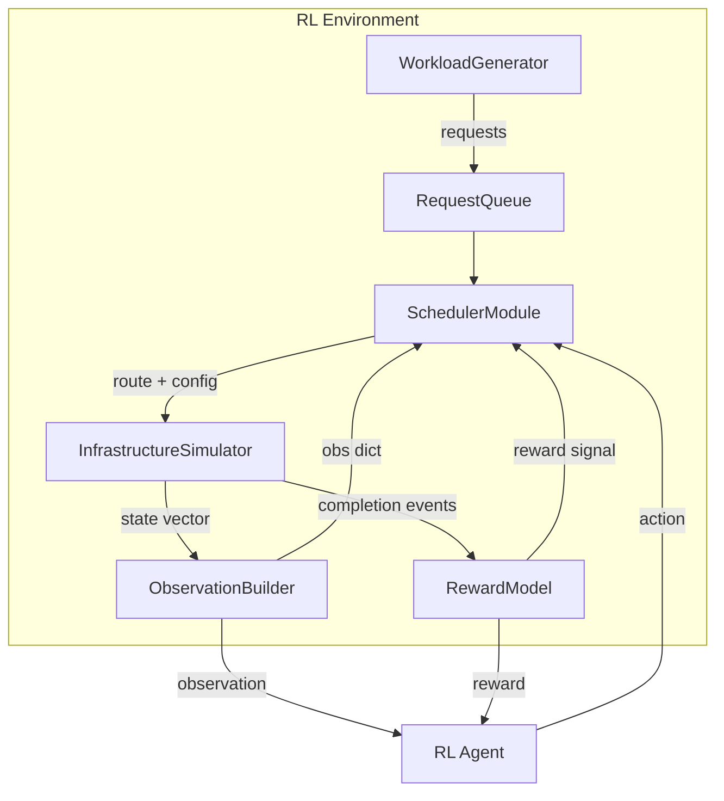
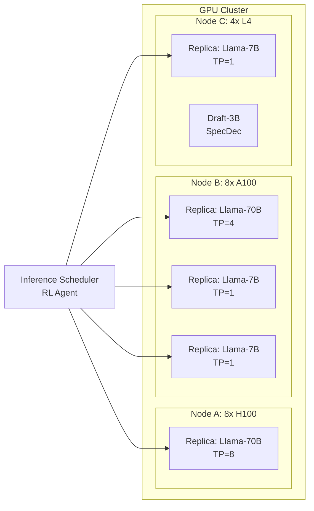
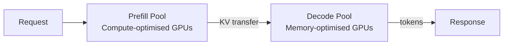
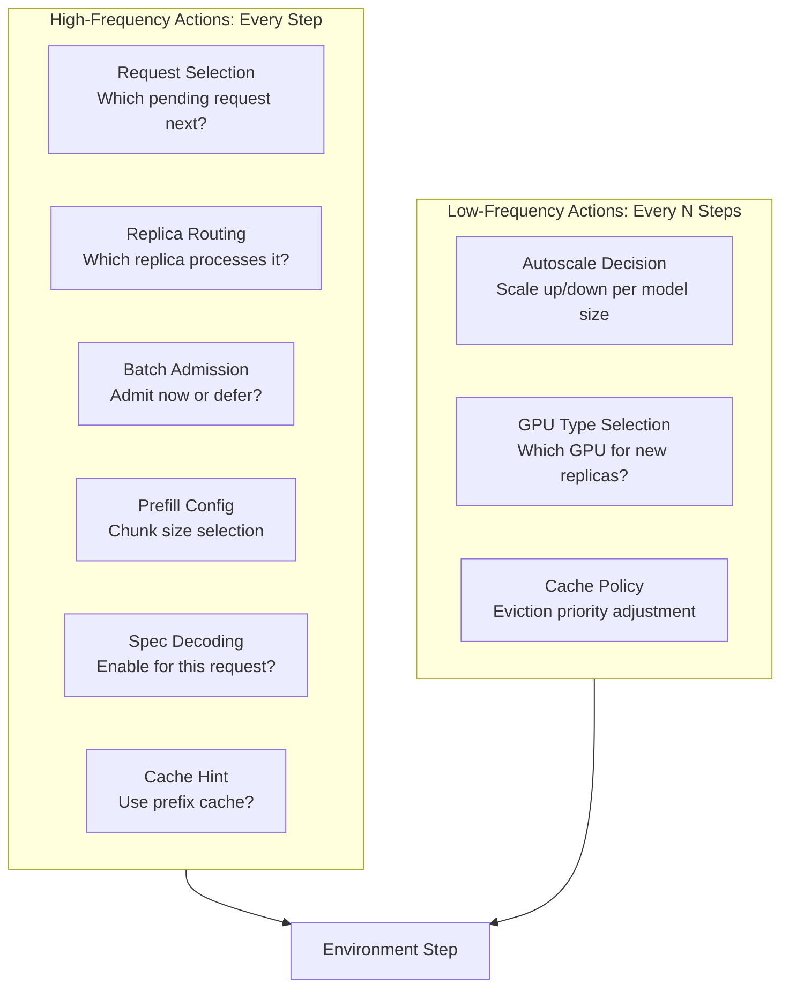
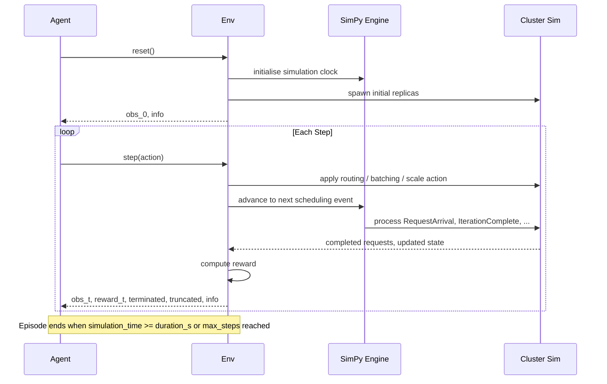

# RL Environment for LLM Inference Request Scheduling

## Design Document

**Version:** 0.1.0
**Date:** 2026-03-26

---

## Table of Contents

1. [Introduction and Motivation](#1-introduction-and-motivation)
2. [Workload Simulation Model](#2-workload-simulation-model)
3. [Infrastructure Simulation Model](#3-infrastructure-simulation-model)
4. [State Space Design](#4-state-space-design)
5. [Action Space Design](#5-action-space-design)
6. [Reward Model Design](#6-reward-model-design)
7. [Episode Structure and Simulation Loop](#7-episode-structure-and-simulation-loop)
8. [Training Considerations](#8-training-considerations)
9. [References](#9-references)

---

## 1. Introduction and Motivation

### 1.1 Problem Statement

Modern LLM inference services face a scheduling problem of extraordinary complexity. A production deployment simultaneously contends with:

- **Heterogeneous requests** — prompts range from 50 tokens (simple chat) to 128K+ tokens (document analysis). Some require chain-of-thought reasoning, others demand tool use, retrieval-augmented generation (RAG), web search, or multi-step planning. Response expectations vary from sub-second streaming to minutes-long deep thinking.
- **Heterogeneous infrastructure** — GPU fleets mix generations (A100, H100, L4), model replicas span sizes (7B, 70B, 405B), and each replica has its own KV cache state, batch occupancy, and parallelism configuration.
- **Conflicting objectives** — operators must jointly minimize latency (TTFT, TPOT), maximise fairness across priority tiers, preserve response quality by routing to appropriately-capable models, minimize GPU cost, and maintain SLO compliance.

No single heuristic (round-robin, shortest-job-first, least-loaded) can navigate this multi-dimensional tradeoff space. The scheduling problem is inherently sequential: each routing decision changes the cluster state for every future decision. Rewards are delayed — a routing choice at time `t` affects tail latency observed at time `t + n`. The combinatorial action space (which request, which replica, what batch config, whether to autoscale) grows exponentially with fleet size.

### 1.2 Why Reinforcement Learning

Reinforcement learning is a natural fit for this problem because:

| Property | Mapping to LLM Scheduling |
|---|---|
| Sequential decision-making | Each scheduling decision alters cluster state for all future decisions |
| Delayed rewards | A routing choice now affects tail latency observed seconds later |
| Combinatorial action space | Request x Replica x BatchConfig x ScaleAction grows exponentially |
| Non-stationary dynamics | Traffic patterns shift across time-of-day, day-of-week, viral events |
| Multi-objective optimisation | Latency, fairness, quality, cost cannot be collapsed into a single heuristic |

An RL agent can learn a policy that adapts to the current cluster state and traffic pattern, discovering scheduling strategies that no hand-written heuristic would encode — such as preemptively scaling up before a predicted burst, or strategically deferring a low-priority long-context request until a batch slot with high prefix-cache overlap opens.

### 1.3 System Overview

The following diagram shows the high-level architecture of the RL environment:



The environment wraps a discrete-event simulator that models GPU clusters, KV caches, batching engines, and network transfers at sufficient fidelity to produce realistic latency and throughput numbers — validated against real systems like vLLM and Sarathi-Serve.

---

## 2. Workload Simulation Model

### 2.1 Request Taxonomy

Every incoming request is characterised along multiple axes. The simulator must faithfully represent this heterogeneity because the optimal scheduling policy depends on request mix.

| Dimension | Categories | Impact on Scheduling |
|---|---|---|
| **Prompt length** | Short (<512 tok), Medium (512-4K), Long (4K-32K), Very Long (32K-128K+) | Determines prefill compute, KV cache memory, batch packing efficiency |
| **Expected output length** | Brief (<64 tok), Standard (64-512), Extended (512-2K), Unbounded | Affects decode phase duration and memory reservation |
| **Reasoning depth** | Direct answer, Shallow CoT, Deep CoT, Multi-step planning | Deep reasoning needs larger models; occupies batch slot longer |
| **Capability requirements** | Plain chat, Code generation, Tool use, RAG, Web search, Vision | Determines which model replicas are eligible |
| **Response mode** | Streaming, Non-streaming | Streaming requires continuous TPOT; non-streaming allows batching flexibility |
| **Priority / SLO tier** | Realtime (P0), Interactive (P1), Batch (P2), Best-effort (P3) | TTFT and TPOT budgets differ by tier |
| **Session affinity** | Stateless, Session-bound (chat history) | Session-bound requests benefit from KV cache reuse on the same replica |

### 2.2 Request Data Structure

Each request `r` entering the queue is a tuple:

```python
@dataclass
class InferenceRequest:
    request_id: str
    arrival_time: float                   # simulation clock timestamp
    prompt_tokens: int                    # actual prompt length
    estimated_output_tokens: int          # sampled from distribution
    request_type: RequestType             # enum: CHAT, CODE, RAG, TOOL_USE, REASONING, VISION
    reasoning_depth: ReasoningDepth       # enum: DIRECT, SHALLOW_COT, DEEP_COT, MULTI_STEP
    slo_tier: SLOTier                     # enum: P0, P1, P2, P3
    ttft_budget_ms: float                 # max acceptable TTFT
    tpot_budget_ms: float                 # max acceptable inter-token latency
    streaming: bool
    session_id: Optional[str]            # None for stateless requests
    prefix_hash: Optional[str]           # hash of prompt prefix for cache matching
    model_affinity: ModelAffinity        # enum: SMALL_ONLY, LARGE_ONLY, ANY
    quality_sensitive: bool              # if True, routing to smaller model degrades quality
```

### 2.3 Traffic Patterns

The workload generator supports multiple traffic regimes, each configurable:

**Poisson Arrivals (Baseline)**
Requests arrive at rate `lambda` following a Poisson process. This is the simplest model and serves as the baseline. The inter-arrival time is sampled as `Exponential(1/lambda)`.

**Bursty Traffic**
Modeled as a Markov-modulated Poisson process (MMPP) with two states — a low-rate state and a high-rate state. Transition probabilities control burst frequency and duration. This simulates scenarios like a popular chatbot going viral or a batch processing job being submitted.

**Diurnal Cycles**
The arrival rate follows a sinusoidal pattern overlaid on a base rate:

```
lambda(t) = lambda_base + lambda_amplitude * sin(2 * pi * t / T_period + phase)
```

where `T_period` is typically 24 hours of simulated time.

**Correlated Bursts**
A burst of requests sharing the same prompt prefix (e.g., many users asking about the same news event). This tests the agent's ability to exploit prefix caching.

**Trace Replay**
Replay real-world traces. Compatible trace formats:

- Azure LLM Inference Trace (2023) — contains prompt/completion token counts, timestamps
- ShareGPT conversation dataset — provides realistic prompt/response distributions
- LMSYS Chatbot Arena logs — multi-model, multi-turn conversations

### 2.4 Workload Generator Configuration

```python
@dataclass
class WorkloadConfig:
    pattern: TrafficPattern              # POISSON, BURSTY, DIURNAL, CORRELATED, TRACE_REPLAY
    base_arrival_rate: float             # requests per second
    burst_multiplier: float              # peak / base ratio for bursty mode
    burst_duration_s: float              # average burst length
    prompt_length_dist: Distribution     # e.g., LogNormal(mu=6.5, sigma=1.2)
    output_length_dist: Distribution     # e.g., LogNormal(mu=5.0, sigma=1.5)
    request_type_weights: Dict[RequestType, float]  # probability of each type
    slo_tier_weights: Dict[SLOTier, float]
    streaming_fraction: float            # fraction of requests that are streaming
    session_fraction: float              # fraction of requests belonging to a session
    prefix_overlap_prob: float           # probability that a new request shares a prefix
    trace_path: Optional[str]            # path to trace file for replay mode
```

The generator supports seeded randomness for reproducible episodes and can compose multiple patterns (e.g., diurnal base + bursty overlay).

---

## 3. Infrastructure Simulation Model

### 3.1 Architecture

The infrastructure simulator models a GPU cluster serving multiple LLM replicas. The design is inspired by production systems (vLLM, Sarathi-Serve, llm-d) and validated against the Microsoft Vidur simulation framework.



### 3.2 GPU Fleet Model

Each GPU in the simulated cluster is defined by a hardware profile:

```python
@dataclass
class GPUProfile:
    gpu_type: str                        # "H100_SXM", "A100_80GB", "L4_24GB"
    memory_gb: float                     # total HBM capacity
    compute_tflops_fp16: float           # peak FP16 TFLOPS
    memory_bandwidth_gbps: float         # HBM bandwidth
    interconnect_bandwidth_gbps: float   # NVLink / PCIe bandwidth
    cost_per_hour: float                 # cloud pricing for cost reward
```

Reference profiles:

| GPU | Memory | FP16 TFLOPS | Bandwidth | $/hr (approx) |
|-----|--------|-------------|-----------|----------------|
| H100 SXM | 80 GB | 989 | 3350 GB/s | $3.50 |
| A100 80GB | 80 GB | 312 | 2039 GB/s | $2.00 |
| L4 | 24 GB | 121 | 300 GB/s | $0.40 |

### 3.3 Model Replica Model

Each replica is an instance of a model running on one or more GPUs:

```python
@dataclass
class ReplicaConfig:
    replica_id: str
    model_name: str                      # "llama-3-70b", "llama-3-7b", etc.
    model_params_b: float                # parameter count in billions
    gpu_type: str
    num_gpus: int
    parallelism: ParallelismConfig       # tensor_parallel, pipeline_parallel degrees
    max_context_length: int              # max supported context window
    max_batch_size: int                  # constrained by GPU memory
    supports_streaming: bool
    capabilities: Set[RequestType]       # what request types this replica can serve
    speculative_decoding: Optional[SpecDecConfig]
```

#### Memory Budget Calculation

For a given replica, the available KV cache memory is:

```
KV_cache_memory = GPU_memory - model_weights - activation_memory - overhead
```

The max batch size and context length are jointly constrained:

```
sum(batch_i.context_length * 2 * n_layers * d_head * n_heads * dtype_bytes) <= KV_cache_memory
```

The simulator dynamically tracks this budget as requests enter and leave batches.

### 3.4 KV Cache Simulation

The KV cache is modeled with the following components, inspired by PagedAttention (vLLM):

**Paged Allocation**
KV cache memory is divided into fixed-size blocks (e.g., 16 tokens per block). Blocks are allocated on demand and freed when a request completes. Internal fragmentation is minimal.

**Prefix Caching**
The simulator maintains a prefix trie keyed by prompt token hashes. When a new request arrives whose prefix matches an existing cached prefix, the simulator:
1. Skips prefill for the cached portion
2. Reduces TTFT by `(cached_tokens / total_prompt_tokens) * base_prefill_time`
3. Avoids re-allocating KV blocks for the cached prefix

Cache hit rate depends on traffic correlation and the configured cache size.

**Eviction Policy**
When cache memory is exhausted, eviction follows one of:
- LRU (least recently used) — default baseline
- LFU (least frequently used)
- RL-guided — the agent provides eviction priority hints (see Action Space)

**Offloading**
KV blocks can be offloaded to CPU memory or disk at a transfer cost:

| Transfer | Latency per block |
|---|---|
| GPU -> CPU (PCIe) | ~0.05 ms |
| GPU -> CPU (NVLink) | ~0.01 ms |
| CPU -> Disk (NVMe) | ~0.5 ms |
| GPU -> Remote GPU (network) | ~0.1 ms |

### 3.5 Batching Engine Simulation

The simulator implements continuous batching with the following mechanics:

**Continuous Batching**
Unlike static batching, requests can join and leave the batch at any iteration boundary. The scheduler decides which pending requests to admit into the next iteration.

**Chunked Prefill (Sarathi-Serve)**
Long prefill requests are split into chunks of configurable size (e.g., 512 or 1024 tokens). This prevents a single long-context request from stalling all in-flight decodes:

```
prefill_iterations = ceil(prompt_tokens / chunk_size)
```

Each chunk shares an iteration with ongoing decode tokens, maintaining decode throughput.

**Iteration Timing Model**
Each iteration's duration is estimated as:

```
t_iteration = max(t_compute, t_memory)

t_compute = (prefill_tokens_this_iter * 2 * model_params) / GPU_TFLOPS
t_memory  = (decode_tokens_this_iter * 2 * n_layers * d_model * sizeof(dtype)) / mem_bandwidth
```

Prefill is compute-bound; decode is memory-bound. The simulator accounts for this asymmetry.

### 3.6 Speculative Decoding Simulation

When enabled, a draft model (smaller, faster) proposes `k` candidate tokens, which the target model verifies in a single forward pass:

```python
@dataclass
class SpecDecConfig:
    draft_model: str                     # e.g., "llama-3-3b"
    draft_model_latency_ms: float        # per-token draft latency
    num_speculative_tokens: int          # k, typically 3-7
    acceptance_rate: float               # average acceptance probability (0.7 - 0.9)
```

Effective speedup:

```
speedup = (1 + k * acceptance_rate) / (1 + draft_overhead_ratio)
```

The acceptance rate varies by request type — code completion has higher acceptance rates than open-ended generation. The simulator samples acceptance per-token from a Bernoulli distribution.

### 3.7 Disaggregated Prefill/Decode (Optional)

Inspired by Splitwise and DistServe, the simulator can optionally model disaggregated serving where prefill and decode run on separate GPU pools:



The KV state transfer cost between pools is modeled as:

```
transfer_time = (num_layers * 2 * d_model * prompt_tokens * dtype_bytes) / network_bandwidth
```

### 3.8 Simulation Engine

The simulation backbone is a **discrete-event simulation** built on SimPy. Key events:

| Event | Trigger |
|---|---|
| `RequestArrival` | Workload generator emits a new request |
| `SchedulingDecision` | Agent selects action (request routing, batching, scaling) |
| `IterationComplete` | A batch iteration finishes on a replica |
| `RequestComplete` | Final token of a request is generated |
| `PrefillChunkDone` | One chunk of a chunked prefill finishes |
| `AutoscaleEvent` | Agent triggers scale-up or scale-down |
| `ReplicaReady` | A newly scaled replica finishes initialization |
| `CacheEviction` | KV cache block is evicted |

The event loop drives the simulation clock forward. The RL agent is invoked at each `SchedulingDecision` event, which fires either:
- **Event-driven**: whenever a new request arrives or a batch slot opens (variable time-steps)
- **Fixed time-step**: at regular intervals (e.g., every 10 ms of simulation time)

---

## 4. State Space Design

### 4.1 Observation Structure

The observation is a structured dictionary with three groups: per-request features for pending requests, per-replica features for active replicas, and global cluster features.

```python
import gymnasium as gym
from gymnasium import spaces
import numpy as np

MAX_PENDING_REQUESTS = 128    # fixed buffer size with masking
MAX_REPLICAS = 16

observation_space = spaces.Dict({
    # --- Per-request features (pending queue) ---
    "pending_requests": spaces.Dict({
        "features": spaces.Box(
            low=0.0, high=1.0,
            shape=(MAX_PENDING_REQUESTS, 14),
            dtype=np.float32
        ),
        "mask": spaces.MultiBinary(MAX_PENDING_REQUESTS),
    }),

    # --- Per-replica features ---
    "replicas": spaces.Dict({
        "features": spaces.Box(
            low=0.0, high=1.0,
            shape=(MAX_REPLICAS, 16),
            dtype=np.float32
        ),
        "mask": spaces.MultiBinary(MAX_REPLICAS),
    }),

    # --- Global features ---
    "global": spaces.Box(
        low=0.0, high=1.0,
        shape=(20,),
        dtype=np.float32
    ),
})
```

### 4.2 Per-Request Feature Vector

Each pending request is encoded as a 14-dimensional normalised vector:

| Index | Feature | Normalisation |
|-------|---------|---------------|
| 0 | `prompt_tokens` | `/ MAX_CONTEXT_LENGTH` |
| 1 | `estimated_output_tokens` | `/ MAX_OUTPUT_LENGTH` |
| 2 | `request_type` (one-hot encoded across multiple indices) | 0 or 1 |
| 3-6 | `request_type` one-hot (CHAT, CODE, RAG, TOOL_USE, REASONING, VISION) | 0 or 1 |
| 7 | `slo_tier` | `/ NUM_TIERS` (ordinal) |
| 8 | `wait_time` | `/ MAX_WAIT_TIME` (clipped) |
| 9 | `streaming` flag | 0 or 1 |
| 10 | `session_bound` flag | 0 or 1 |
| 11 | `prefix_cache_matchability` | 0.0 to 1.0 (fraction of prompt matchable) |
| 12 | `quality_sensitive` flag | 0 or 1 |
| 13 | `ttft_slack` | `(ttft_budget - elapsed_wait) / ttft_budget` (urgency signal) |

The `mask` vector is 1 for valid entries and 0 for padding. This allows the agent to handle variable-length queues in a fixed-size tensor.

### 4.3 Per-Replica Feature Vector

Each replica is encoded as a 16-dimensional normalised vector:

| Index | Feature | Normalisation |
|-------|---------|---------------|
| 0 | `model_size` | `/ MAX_MODEL_SIZE_B` |
| 1 | `gpu_type` (ordinal encoding) | `/ NUM_GPU_TYPES` |
| 2 | `num_gpus` | `/ MAX_GPUS_PER_REPLICA` |
| 3 | `current_batch_size` | `/ max_batch_size` |
| 4 | `kv_cache_utilization` | 0.0 to 1.0 |
| 5 | `queue_depth` | `/ MAX_QUEUE_DEPTH` |
| 6 | `avg_ttft_recent` | `/ TTFT_NORM` (rolling window) |
| 7 | `avg_tpot_recent` | `/ TPOT_NORM` (rolling window) |
| 8 | `prefill_ratio` | fraction of current batch in prefill phase |
| 9 | `speculative_decoding_enabled` | 0 or 1 |
| 10 | `estimated_next_slot_time` | `/ SLOT_TIME_NORM` |
| 11 | `prefix_cache_hit_rate` | 0.0 to 1.0 (recent window) |
| 12 | `supports_streaming` | 0 or 1 |
| 13-15 | `capability_flags` (code, rag, reasoning) | 0 or 1 |

### 4.4 Global Feature Vector

A 20-dimensional vector capturing cluster-wide state:

| Index | Feature |
|-------|---------|
| 0 | `total_pending_requests / MAX_PENDING_REQUESTS` |
| 1 | `arrival_rate_1s` (1-second sliding window, normalised) |
| 2 | `arrival_rate_10s` (10-second sliding window, normalised) |
| 3 | `arrival_rate_60s` (60-second sliding window, normalised) |
| 4 | `cluster_gpu_memory_utilization` (average across all GPUs) |
| 5 | `cluster_compute_utilization` (average across all GPUs) |
| 6-8 | `active_replicas_per_model_size` (small / medium / large, normalised) |
| 9 | `autoscaler_cooldown_remaining / COOLDOWN_PERIOD` |
| 10 | `goodput_1min` (% requests meeting SLO in last 60s) |
| 11 | `goodput_5min` (% requests meeting SLO in last 5 min) |
| 12 | `cost_accumulator / EPISODE_BUDGET` |
| 13 | `avg_queue_wait_time / MAX_WAIT_TIME` |
| 14 | `p99_ttft_recent / TTFT_NORM` |
| 15 | `p99_tpot_recent / TPOT_NORM` |
| 16 | `simulation_time_elapsed / EPISODE_DURATION` |
| 17 | `cache_hit_rate_global` |
| 18 | `streaming_request_fraction` (in current queue) |
| 19 | `slo_violation_rate_1min` |

### 4.5 Variable-Length Handling

The observation uses **fixed-size buffers with attention masks**, a standard technique in RL for variable-length inputs:

- If there are fewer pending requests than `MAX_PENDING_REQUESTS`, extra slots are zero-filled and the mask is set to 0.
- If the queue exceeds `MAX_PENDING_REQUESTS`, the oldest `MAX_PENDING_REQUESTS` requests are included (or the top by urgency), with an overflow flag in the global features.
- The agent architecture should use a masked attention or set-encoder (e.g., Deep Sets, Transformer) over the variable-length request and replica sets.

---

## 5. Action Space Design

### 5.1 Hierarchical Action Decomposition

The action space is decomposed into **high-frequency** decisions (made every scheduling step) and **low-frequency** decisions (made every `N` steps or on a separate timescale):



### 5.2 Action Space Definition

```python
action_space = spaces.Dict({
    # High-frequency actions
    "request_index": spaces.Discrete(MAX_PENDING_REQUESTS),
    "replica_index": spaces.Discrete(MAX_REPLICAS),
    "batch_admission": spaces.Discrete(2),              # 0=defer, 1=admit
    "chunk_size_level": spaces.Discrete(4),              # 0=256, 1=512, 2=1024, 3=2048
    "speculative_decoding": spaces.Discrete(2),          # 0=off, 1=on
    "use_prefix_cache": spaces.Discrete(2),              # 0=bypass, 1=use

    # Low-frequency actions (applied every N steps)
    "autoscale_small_model": spaces.Discrete(5),         # 0=scale-down-2, 1=scale-down-1, 2=no-op, 3=scale-up-1, 4=scale-up-2
    "autoscale_large_model": spaces.Discrete(5),         # same encoding
    "new_replica_gpu_type": spaces.Discrete(3),          # 0=H100, 1=A100, 2=L4
    "cache_eviction_policy": spaces.Discrete(3),         # 0=LRU, 1=LFU, 2=urgency-weighted
})
```

### 5.3 Action Masking

Invalid actions must be masked to prevent the agent from selecting nonsensical actions:

| Action | Invalid When |
|---|---|
| `request_index = i` | `pending_requests.mask[i] == 0` (no request at that index) |
| `replica_index = j` | `replicas.mask[j] == 0` (replica not active), or replica lacks capability for selected request |
| `batch_admission = 1` | Selected replica's batch is full, or KV cache memory insufficient for the request |
| `speculative_decoding = 1` | Selected replica has no draft model configured |
| `autoscale_small_model = 0 or 1` | Already at minimum replicas for that model size |
| `autoscale_small_model = 3 or 4` | Already at maximum replicas, or no GPUs available |

The environment provides an `action_mask` alongside each observation. Compatible with Masked PPO implementations in libraries like SB3-Contrib and CleanRL.

```python
def get_action_mask(self) -> Dict[str, np.ndarray]:
    return {
        "request_index": self._pending_request_mask(),
        "replica_index": self._eligible_replica_mask(selected_request),
        "batch_admission": self._batch_admission_mask(selected_replica),
        "speculative_decoding": self._spec_dec_mask(selected_replica),
        "autoscale_small_model": self._autoscale_mask("small"),
        "autoscale_large_model": self._autoscale_mask("large"),
        # ...
    }
```

### 5.4 Multi-Request Scheduling

In practice, the agent may need to schedule multiple requests per step (e.g., fill a batch). Two approaches:

**Option A — Single-request-per-step**: The environment calls the agent once per request. Simple but potentially slow for large batches.

**Option B — Autoregressive batch construction**: The agent is called repeatedly within a single environment step to fill a batch, with the observation updated after each sub-decision. The step concludes when the agent selects `batch_admission = 0` (defer) or the batch is full. This is more efficient but requires a stateful inner loop.

The recommended approach is **Option A** for initial development (simplicity) with a migration path to **Option B** for performance.

### 5.5 Hierarchical RL Integration

The high-frequency / low-frequency split maps naturally to a **hierarchical RL** (options) framework:

- **Manager policy** (low-frequency): Observes global features every `N` steps (e.g., every 100 scheduling decisions or every simulated second). Outputs autoscaling and cache policy actions.
- **Worker policy** (high-frequency): Observes the full state at every scheduling decision. Outputs request selection, routing, batching, and speculative decoding actions.

The manager sets context (number of replicas, cache policy) that constrains the worker's action space. Both policies are trained jointly but at different temporal resolutions.

---

## 6. Reward Model Design

### 6.1 Multi-Objective Reward

The reward function balances five objectives using configurable weights. The reward is emitted at two timescales:

- **Per-completion reward**: emitted when a request finishes (or is dropped)
- **Per-step reward**: emitted at every environment step for ongoing costs

```python
@dataclass
class RewardWeights:
    w_ttft: float = 1.0          # TTFT latency penalty
    w_tpot: float = 0.5          # TPOT latency penalty
    w_slo_violation: float = 5.0 # SLO breach penalty
    w_fairness: float = 0.3      # fairness penalty
    w_quality: float = 2.0       # quality match reward
    w_cost: float = 0.1          # GPU cost penalty
    w_throughput: float = 0.2    # throughput bonus
    w_starvation: float = 10.0   # starvation hard penalty
    w_autoscale_churn: float = 1.0  # scaling event penalty
```

### 6.2 Latency Reward (Per-Completion)

For each completed request `r`:

```
R_latency(r) = -w_ttft * (r.actual_ttft / r.ttft_budget)
             - w_tpot  * (r.actual_tpot / r.tpot_budget)
```

Normalising by the request's own SLO budget means a P0 request that barely meets its tight budget gets a similar penalty to a P2 request that barely meets its loose budget — the penalty reflects *relative* SLO stress.

**SLO Violation Penalty** (step function):

```
R_slo(r) = -w_slo_violation  if r.actual_ttft > r.ttft_budget OR r.actual_tpot > r.tpot_budget
           0                 otherwise
```

This sharp penalty ensures the agent strongly avoids SLO breaches rather than treating the budget as a soft target.

### 6.3 Fairness Reward (Per-Step)

Fairness is measured within each SLO tier using Jain's fairness index:

```
J(tier) = (sum(wait_times))^2 / (n * sum(wait_times^2))
```

where `n` is the number of pending requests in that tier and `wait_times` are the current wait times. `J = 1.0` is perfectly fair; `J = 1/n` is maximally unfair.

```
R_fairness = -w_fairness * sum_over_tiers(1.0 - J(tier))
```

**Starvation Penalty**: Any request that has waited longer than `MAX_WAIT_THRESHOLD` (e.g., 5x its TTFT budget) triggers a hard penalty:

```
R_starvation = -w_starvation * count(starved_requests)
```

### 6.4 Quality Reward (Per-Completion)

Quality captures whether the request was routed to an appropriately-capable model:

```
R_quality(r) =  +w_quality  if quality_sensitive AND routed to large/appropriate model
               -w_quality   if quality_sensitive AND routed to undersized model
                0           if not quality_sensitive
```

The quality signal can be made continuous by using a model-capability score:

```
capability_score = model_capability_for_request_type(replica, request) ∈ [0, 1]
R_quality(r) = w_quality * (capability_score - 0.5) * 2   # range [-w, +w]
```

### 6.5 Cost Reward (Per-Step)

```
R_cost = -w_cost * sum_over_replicas(replica.gpu_cost_per_second * replica.num_gpus * dt)
       - w_autoscale_churn * num_autoscale_events_this_step
```

The `dt` is the time elapsed in this step. The autoscale churn penalty discourages rapid oscillation (thrashing) in replica counts.

### 6.6 Throughput Bonus (Per-Step)

```
R_throughput = +w_throughput * requests_completed_this_step
```

This ensures the agent is incentivised to actually process requests rather than deferring them indefinitely.

### 6.7 Composite Reward

The total reward at each step is:

```
R_total = sum(R_latency(r) + R_slo(r) + R_quality(r) for r in completed_this_step)
        + R_fairness
        + R_cost
        + R_throughput
        + R_starvation
```

### 6.8 Reward Shaping and Normalisation

To stabilise training:

- All reward components are normalised to roughly the same scale `[-1, 1]` before weighting.
- A **reward scaler** tracks running mean and variance of the composite reward and applies z-score normalisation. This is handled as a Gymnasium `RewardWrapper`.
- **Potential-based shaping**: An optional shaping term `F(s, s') = gamma * Phi(s') - Phi(s)` can guide exploration without changing the optimal policy. A useful potential function is `Phi(s) = -total_pending_requests / MAX_PENDING_REQUESTS` (encouraging the agent to keep the queue short).

### 6.9 Evaluation Metrics

The reward function trains the agent, but evaluation uses human-interpretable metrics:

| Metric | Definition | Target |
|--------|-----------|--------|
| **Goodput** | % of requests meeting both TTFT and TPOT SLOs | > 95% |
| **P50 / P99 TTFT** | Median and tail TTFT across all requests | Minimise |
| **P50 / P99 TPOT** | Median and tail inter-token latency | Minimise |
| **Jain's Fairness Index** | Fairness of wait times within each tier | > 0.9 |
| **Quality Match Rate** | % of quality-sensitive requests routed to appropriate model | > 90% |
| **Cost Efficiency** | Requests served per GPU-hour | Maximise |
| **Autoscale Stability** | Number of scale events per episode | Minimise |
| **Cache Hit Rate** | Prefix cache hit rate across cluster | Maximise |
| **Throughput** | Requests completed per second | Maximise |

---

## 7. Episode Structure and Simulation Loop

### 7.1 Episode Definition

An **episode** is a configurable time window of simulated traffic:

```python
@dataclass
class EpisodeConfig:
    duration_s: float = 3600.0          # 1 hour of simulated time
    warmup_s: float = 60.0              # warmup period (no reward, fill cluster)
    step_mode: StepMode = StepMode.EVENT_DRIVEN  # or FIXED_TIMESTEP
    fixed_timestep_ms: float = 10.0     # only for FIXED_TIMESTEP mode
    low_freq_interval: int = 100        # autoscale decision every N high-freq steps
    max_steps: int = 100_000            # episode truncation safety limit
    budget_limit: Optional[float] = None  # cost budget (terminate if exceeded)
```

### 7.2 Simulation Loop



### 7.3 Reset Semantics

On `env.reset()`:

1. Re-sample the traffic pattern (new random seed unless deterministic mode).
2. Initialise the cluster to a configurable starting state (e.g., 2 small replicas, 1 large replica).
3. Run a warmup period where requests arrive and are scheduled by a simple heuristic (round-robin), building up KV cache state and filling batches. No reward is accumulated during warmup.
4. Return the first observation after warmup.

### 7.4 Termination Conditions

| Condition | Type | Description |
|-----------|------|-------------|
| `simulation_time >= duration_s` | `terminated = True` | Normal episode end |
| `steps >= max_steps` | `truncated = True` | Safety truncation |
| `cost_accumulator >= budget_limit` | `terminated = True` | Budget exhaustion (optional) |
| All replicas scaled to zero | `terminated = True` | Cluster death (should be heavily penalised) |

### 7.5 Information Dict

The `info` dict returned at each step contains debugging and logging data:

```python
info = {
    "simulation_time": float,
    "requests_completed_total": int,
    "requests_dropped_total": int,
    "goodput": float,
    "p50_ttft": float,
    "p99_ttft": float,
    "p50_tpot": float,
    "p99_tpot": float,
    "jains_fairness": Dict[str, float],     # per SLO tier
    "total_cost": float,
    "active_replicas": Dict[str, int],       # per model size
    "cache_hit_rate": float,
    "autoscale_events": int,
    "slo_violations": int,
}
```

---

## 8. Training Considerations

### 8.1 Algorithm Selection

| Algorithm | Fit | Rationale |
|-----------|-----|-----------|
| **Masked PPO** | Primary | On-policy, handles discrete action masking natively, stable with multi-objective rewards. Implementations in SB3-Contrib and CleanRL. |
| **SAC (discrete)** | Alternative | Off-policy (better sample efficiency), works well if action space is flattened to a single categorical. |
| **Hierarchical PPO** | Scaling decisions | Manager-worker architecture where the manager policy operates at a slower timescale for autoscaling. |
| **Multi-Agent PPO (MAPPO)** | Per-replica agents | Each replica runs its own scheduling agent; a central critic coordinates. Useful for very large clusters. |

### 8.2 Network Architecture

The observation structure (variable-length sets of requests and replicas + global features) calls for a **set-encoder** architecture:

```
Request Encoder:  per-request MLP -> masked mean-pool / attention -> request_embedding
Replica Encoder:  per-replica MLP -> masked mean-pool / attention -> replica_embedding
Global Encoder:   MLP(global_features) -> global_embedding

Combined: concat(request_embedding, replica_embedding, global_embedding) -> shared MLP -> policy heads
```

For request-to-replica routing, a **cross-attention** mechanism between request embeddings and replica embeddings can produce a compatibility matrix, from which the agent selects the `(request, replica)` pair.

### 8.3 Curriculum Learning

Training should progress through increasing difficulty:

| Stage | Traffic | Cluster | Objective |
|-------|---------|---------|-----------|
| 1 | Poisson, uniform request types | 2-3 homogeneous replicas, no autoscaling | Minimise TTFT only |
| 2 | Poisson, mixed request types | Heterogeneous replicas, no autoscaling | Multi-objective (latency + quality) |
| 3 | Bursty traffic, mixed types | Heterogeneous replicas, autoscaling enabled | Full multi-objective |
| 4 | Diurnal + bursty, correlated prefixes | Full cluster with KV cache, speculative decoding | Full objective with cost |
| 5 | Trace replay from production | Production-scale cluster | Full objective, compare to baselines |

### 8.4 Baselines for Comparison

The following heuristic baselines should be implemented for fair evaluation:

| Baseline | Strategy |
|----------|----------|
| **Random** | Randomly select request and replica |
| **Round-Robin** | Cycle through replicas in order |
| **Least-Loaded** | Route to replica with lowest `current_batch_size / max_batch_size` |
| **Shortest-Job-First** | Prioritise requests with smallest `prompt_tokens + estimated_output_tokens` |
| **Shortest-Remaining-Time-First** | Prioritise requests closest to SLO deadline |
| **Capability-Aware Least-Loaded** | Filter replicas by capability, then least-loaded |
| **Prefix-Affinity** | Route to replica with highest prefix cache match |
| **Production Heuristic** | Composite: capability filter -> prefix affinity -> least-loaded tie-break (approximates llm-d) |

### 8.5 Hyperparameter Recommendations

```python
training_config = {
    "algorithm": "MaskedPPO",
    "learning_rate": 3e-4,
    "gamma": 0.99,
    "gae_lambda": 0.95,
    "clip_range": 0.2,
    "entropy_coef": 0.01,             # encourage exploration
    "value_coef": 0.5,
    "max_grad_norm": 0.5,
    "n_steps": 2048,                   # steps per rollout
    "batch_size": 64,
    "n_epochs": 10,                    # PPO epochs per update
    "total_timesteps": 10_000_000,     # ~2500 episodes at 4000 steps/ep
    "reward_normalisation": True,
    "observation_normalisation": True,
}
```

### 8.6 Reproducibility

- All random number generators (workload, simulation, RL) accept explicit seeds.
- Environment supports `gymnasium.utils.seeding`.
- Episode configs are serialisable to JSON for experiment tracking.
- Integration with Weights & Biases or MLflow for metric logging.

---

## 9. References

### 9.1 Core LLM Serving Systems

1. **PagedAttention / vLLM** — Kwon et al., "Efficient Memory Management for Large Language Model Serving with PagedAttention," SOSP 2023.
   [arXiv:2309.06180](https://arxiv.org/abs/2309.06180) |
   [GitHub](https://github.com/vllm-project/vllm)
   Introduced paged KV cache management achieving near-zero memory waste and 2-4x throughput improvement over prior systems.

2. **Orca** — Yu et al., "Orca: A Distributed Serving System for Transformer-Based Generative Models," OSDI 2022.
   [Paper](https://www.usenix.org/conference/osdi22/presentation/yu)
   Pioneered continuous (iteration-level) batching for LLM serving, enabling dynamic request scheduling at each generation step.

3. **Sarathi-Serve** — Agrawal et al., "Taming Throughput-Latency Tradeoff in LLM Inference with Sarathi-Serve," OSDI 2024.
   [arXiv:2403.02310](https://arxiv.org/abs/2403.02310)
   Introduced chunked prefills and stall-free scheduling, achieving up to 5.6x higher serving capacity.

4. **Splitwise** — Patel et al., "Splitwise: Efficient Generative LLM Inference Using Phase Splitting," ISCA 2024.
   [arXiv:2311.18677](https://arxiv.org/abs/2311.18677)
   Disaggregates prefill and decode phases onto separate machines optimised for each phase's compute profile.

5. **DistServe** — Zhong et al., "DistServe: Disaggregating Prefill and Decoding for Goodput-optimized Large Language Model Serving," OSDI 2024.
   [arXiv:2401.09670](https://arxiv.org/abs/2401.09670)
   Eliminates prefill-decode interference by assigning phases to different GPUs, serving 4.48-7.4x more requests within SLO.

6. **llm-d** — Red Hat, "llm-d: Distributed LLM Inference Scheduler for Kubernetes," 2025-2026.
   [Docs](https://llm-d.ai/docs/architecture) |
   [GitHub](https://github.com/llm-d)
   Production-grade Kubernetes-native inference scheduler with prefix-cache-aware routing and workload-variant autoscaling.

7. **vLLM Speculative Decoding** — vLLM Blog, "How Speculative Decoding Boosts vLLM Performance by up to 2.8x," 2024.
   [Blog](https://vllm-project.github.io/2024/10/17/spec-decode.html)
   Details the integration of draft-target model speculative decoding into the vLLM continuous batching scheduler.

### 9.2 SLO-Aware and Fair Scheduling

8. **Scorpio** — "Serving the Right Requests at the Right Time for Heterogeneous SLOs in LLM Inference," 2025.
   [arXiv:2505.23022](https://arxiv.org/abs/2505.23022)
   TTFT Guard and TPOT Guard mechanisms for heterogeneous SLO attainment, improving adherence by up to 46.5%.

9. **SOLA** — "State-Aware Scheduling for LLM Serving," Tsinghua University, 2024.
   [Paper](https://nicsefc.ee.tsinghua.edu.cn)
   Improves SLO attainment from 45.5% to 99.4% through state-aware prefill/decode scheduling.

10. **Ascendra** — "Dynamic Request Prioritization for Efficient LLM Serving," 2025.
    [arXiv:2504.20828](https://arxiv.org/abs/2504.20828)
    Partitioned GPU resources with dynamic prioritisation achieving 1.7x higher throughput while meeting TTFT and TBT SLOs.

11. **OrbitFlow** — "SLO-Aware Long-Context LLM Serving with Fine-Grained KV Cache Reconfiguration," 2025.
    [arXiv:2601.10729](https://arxiv.org/abs/2601.10729)
    Lightweight ILP solver for per-layer KV cache retention decisions, improving SLO attainment by up to 66%.

### 9.3 RL-Based Routing and Scheduling

12. **Router-R1** — Zhang et al., "Teaching LLMs Multi-Round Routing and Aggregation via Reinforcement Learning," 2025.
    [arXiv:2506.09033](https://arxiv.org/abs/2506.09033)
    RL-trained LLM router with interleaved think/route actions and rule-based reward combining format, outcome, and cost signals.

13. **xRouter** — "Training Cost-Aware LLMs Orchestration System via Reinforcement Learning," 2025.
    [arXiv:2510.08439](https://arxiv.org/abs/2510.08439)
    Frames routing as decision-making under uncertainty with success-contingent, cost-sensitive rewards.

14. **PickLLM** — "Lightweight RL Framework for LLM Routing," 2024.
    [arXiv:2412.12170](https://arxiv.org/abs/2412.12170)
    Weighted reward functions considering per-query cost, inference latency, and response accuracy with Q-learning and epsilon-greedy.

15. **M-CMAB** — "Adapter-Augmented Bandits for Online Multi-Constrained Multi-Modal Inference Scheduling," 2026.
    [arXiv:2603.06403](https://arxiv.org/abs/2603.06403)
    Contextual multi-armed bandits for multi-constraint scheduling across heterogeneous backends.

16. **SAIR** — "LLMs as In-Context RL Controllers for Autoscaling ML Inference Pipelines," 2025.
    [arXiv:2601.22397](https://arxiv.org/abs/2601.22397)
    Uses LLMs as RL controllers for autoscaling, improving P99 latency by 50% and reducing cost by 97%.

17. **Seer** — "Optimizing Rollout Phase in RL for LLM Serving," 2025.
    [arXiv:2511.14617](https://arxiv.org/abs/2511.14617)
    Context-aware scheduling and adaptive speculative decoding for 74-97% rollout throughput improvement.

### 9.4 KV Cache Optimisation

18. **KV Policy (KVP)** — "Learning to Evict from Key-Value Cache," 2026.
    [arXiv:2602.10238](https://arxiv.org/abs/2602.10238)
    Frames KV cache eviction as an RL problem with per-head agents that learn token eviction priorities.

19. **Prefix Caching in vLLM and llm-d** — llm-d Blog, "KV-Cache Wins You Can See," 2025.
    [Blog](https://llm-d.ai/blog/kvcache-wins-you-can-see)
    Demonstrates 57x faster responses and 2x throughput through prefix-cache-aware distributed scheduling.

20. **LMCache / KServe** — KServe Docs, "KV Cache Offloading," 2025.
    [Docs](https://kserve.github.io/website/docs/next/model-serving/generative-inference/kvcache-offloading)
    Distributed KV cache offloading across multiple vLLM instances via CPU/Redis backends.

### 9.5 Simulation Frameworks

21. **Vidur** — Microsoft, "A Large-Scale Simulation Framework for LLM Inference," MLSys 2024.
    [arXiv](https://proceedings.mlsys.org/paper_files/paper/2024/hash/b74a8de47d2b3c928360e0a011f48351-Abstract-Conference.html) |
    [GitHub](https://github.com/microsoft/vidur)
    High-fidelity LLM inference simulator with <5% error, enabling configuration optimisation without GPU access.

22. **Helix** — "Distributed LLM Serving in Heterogeneous Clusters," ASPLOS 2025.
    [GitHub](https://github.com/Thesys-lab/Helix-ASPLOS25)
    Discrete-event simulator for distributed LLM serving with MILP-based model placement.

23. **EAS-Sim** — "Energy-Aware Scheduling Simulator for Heterogeneous AI Clusters," 2025.
    [GitHub](https://github.com/HPC-CRI/EAS-Sim)
    SimPy-based discrete-event simulator for GPU cluster scheduling with multi-objective metrics.

24. **Gymnasium** — Farama Foundation, "Gymnasium: A Standard API for RL Environments."
    [Docs](https://gymnasium.farama.org/) |
    [GitHub](https://github.com/Farama-Foundation/Gymnasium)
    The standard Python API for RL environments used as the interface layer for this project.

### 9.6 RL Algorithms and Libraries

25. **Stable Baselines3** — Raffin et al., "Stable-Baselines3: Reliable Reinforcement Learning Implementations."
    [Docs](https://stable-baselines3.readthedocs.io/) |
    [GitHub](https://github.com/DLR-RM/stable-baselines3)
    PPO, SAC, and other algorithms with SB3-Contrib providing Masked PPO.

26. **CleanRL** — Huang et al., "CleanRL: High-quality Single-file Implementations of Deep RL Algorithms."
    [GitHub](https://github.com/vwxyzjn/cleanrl)
    Single-file implementations ideal for research modifications.

---

## Appendix A: Gymnasium Environment Skeleton

```python
import gymnasium as gym
from gymnasium import spaces
import numpy as np
from typing import Dict, Any, Optional, Tuple


class LLMInferenceSchedulingEnv(gym.Env):
    """
    RL environment for LLM inference request scheduling.

    Simulates a GPU cluster serving heterogeneous LLM inference requests.
    The agent decides request routing, batching, caching, and autoscaling
    to minimise latency, maximise fairness, and control cost.
    """

    metadata = {"render_modes": ["human", "ansi"], "render_fps": 30}

    def __init__(
        self,
        workload_config: "WorkloadConfig",
        cluster_config: "ClusterConfig",
        episode_config: "EpisodeConfig",
        reward_weights: "RewardWeights",
        render_mode: Optional[str] = None,
    ):
        super().__init__()
        self.workload_config = workload_config
        self.cluster_config = cluster_config
        self.episode_config = episode_config
        self.reward_weights = reward_weights
        self.render_mode = render_mode

        # Spaces
        self.observation_space = self._build_observation_space()
        self.action_space = self._build_action_space()

        # Simulation state (initialised in reset)
        self._sim_engine = None
        self._cluster = None
        self._workload_gen = None

    def _build_observation_space(self) -> spaces.Dict:
        MAX_PENDING = 128
        MAX_REPLICAS = 16
        return spaces.Dict({
            "pending_requests": spaces.Dict({
                "features": spaces.Box(0.0, 1.0, shape=(MAX_PENDING, 14), dtype=np.float32),
                "mask": spaces.MultiBinary(MAX_PENDING),
            }),
            "replicas": spaces.Dict({
                "features": spaces.Box(0.0, 1.0, shape=(MAX_REPLICAS, 16), dtype=np.float32),
                "mask": spaces.MultiBinary(MAX_REPLICAS),
            }),
            "global": spaces.Box(0.0, 1.0, shape=(20,), dtype=np.float32),
        })

    def _build_action_space(self) -> spaces.Dict:
        return spaces.Dict({
            "request_index": spaces.Discrete(128),
            "replica_index": spaces.Discrete(16),
            "batch_admission": spaces.Discrete(2),
            "chunk_size_level": spaces.Discrete(4),
            "speculative_decoding": spaces.Discrete(2),
            "use_prefix_cache": spaces.Discrete(2),
            "autoscale_small_model": spaces.Discrete(5),
            "autoscale_large_model": spaces.Discrete(5),
            "new_replica_gpu_type": spaces.Discrete(3),
            "cache_eviction_policy": spaces.Discrete(3),
        })

    def reset(
        self, *, seed: Optional[int] = None, options: Optional[Dict[str, Any]] = None
    ) -> Tuple[Dict[str, Any], Dict[str, Any]]:
        super().reset(seed=seed)
        # 1. Initialise simulation engine
        # 2. Spawn initial replicas
        # 3. Start workload generator
        # 4. Run warmup period with heuristic scheduler
        # 5. Build and return initial observation
        obs = self._build_observation()
        info = self._build_info()
        return obs, info

    def step(
        self, action: Dict[str, Any]
    ) -> Tuple[Dict[str, Any], float, bool, bool, Dict[str, Any]]:
        # 1. Validate and mask action
        # 2. Apply high-frequency actions (routing, batching, cache)
        # 3. Conditionally apply low-frequency actions (autoscaling)
        # 4. Advance simulation to next scheduling event
        # 5. Collect completed requests
        # 6. Compute reward
        # 7. Check termination conditions
        # 8. Build observation
        obs = self._build_observation()
        reward = self._compute_reward()
        terminated = self._check_terminated()
        truncated = self._check_truncated()
        info = self._build_info()
        return obs, reward, terminated, truncated, info

    def _build_observation(self) -> Dict[str, Any]:
        """Encode current simulation state into observation dict."""
        ...

    def _compute_reward(self) -> float:
        """Compute multi-objective reward for this step."""
        ...

    def _build_info(self) -> Dict[str, Any]:
        """Build info dict with evaluation metrics."""
        ...

    def _check_terminated(self) -> bool:
        """Check if episode should terminate."""
        ...

    def _check_truncated(self) -> bool:
        """Check if episode should be truncated."""
        ...

    def get_action_mask(self) -> Dict[str, np.ndarray]:
        """Return validity masks for each action dimension."""
        ...

    def render(self):
        """Render current state for debugging."""
        ...

    def close(self):
        """Clean up simulation resources."""
        ...
```

---

## Appendix B: Reward Function Reference Implementation

```python
def compute_reward(
    completed_requests: list,
    pending_requests: list,
    active_replicas: list,
    dt: float,
    autoscale_events: int,
    weights: "RewardWeights",
) -> float:
    reward = 0.0

    # --- Per-completion rewards ---
    for r in completed_requests:
        ttft_ratio = r.actual_ttft / r.ttft_budget
        tpot_ratio = r.actual_tpot / r.tpot_budget

        reward -= weights.w_ttft * min(ttft_ratio, 3.0)
        reward -= weights.w_tpot * min(tpot_ratio, 3.0)

        if ttft_ratio > 1.0 or tpot_ratio > 1.0:
            reward -= weights.w_slo_violation

        capability = model_capability_score(r.replica, r.request)
        if r.quality_sensitive:
            reward += weights.w_quality * (capability - 0.5) * 2.0

    # --- Throughput bonus ---
    reward += weights.w_throughput * len(completed_requests)

    # --- Fairness penalty ---
    for tier in SLOTier:
        tier_requests = [r for r in pending_requests if r.slo_tier == tier]
        if len(tier_requests) > 1:
            waits = [r.current_wait_time for r in tier_requests]
            jains = sum(waits) ** 2 / (len(waits) * sum(w ** 2 for w in waits))
            reward -= weights.w_fairness * (1.0 - jains)

    # --- Starvation penalty ---
    starved = sum(
        1 for r in pending_requests
        if r.current_wait_time > 5.0 * r.ttft_budget
    )
    reward -= weights.w_starvation * starved

    # --- Cost penalty ---
    for replica in active_replicas:
        reward -= weights.w_cost * replica.cost_per_second * replica.num_gpus * dt

    reward -= weights.w_autoscale_churn * autoscale_events

    return reward
```

---

## Appendix C: Configuration Presets

### C.1 Small-Scale Development

```python
dev_config = {
    "cluster": {
        "gpus": [{"type": "A100_80GB", "count": 4}],
        "replicas": [
            {"model": "llama-3-7b", "gpus": 1, "count": 2},
            {"model": "llama-3-70b", "gpus": 2, "count": 1},
        ],
    },
    "workload": {
        "pattern": "POISSON",
        "base_arrival_rate": 5.0,
        "request_types": {"CHAT": 0.5, "CODE": 0.2, "RAG": 0.2, "REASONING": 0.1},
    },
    "episode": {"duration_s": 300, "warmup_s": 10},
}
```

### C.2 Production-Scale Evaluation

```python
prod_config = {
    "cluster": {
        "gpus": [
            {"type": "H100_SXM", "count": 32},
            {"type": "A100_80GB", "count": 16},
            {"type": "L4_24GB", "count": 8},
        ],
        "replicas": [
            {"model": "llama-3-7b", "gpus": 1, "count": 8, "gpu_type": "L4_24GB"},
            {"model": "llama-3-70b", "gpus": 4, "count": 4, "gpu_type": "A100_80GB"},
            {"model": "llama-3-405b", "gpus": 8, "count": 2, "gpu_type": "H100_SXM"},
        ],
        "autoscaling": {"enabled": True, "min_replicas": 1, "max_replicas": 12, "cooldown_s": 60},
    },
    "workload": {
        "pattern": "DIURNAL_WITH_BURSTS",
        "base_arrival_rate": 50.0,
        "burst_multiplier": 5.0,
        "request_types": {
            "CHAT": 0.35, "CODE": 0.15, "RAG": 0.15,
            "REASONING": 0.15, "TOOL_USE": 0.1, "VISION": 0.1,
        },
        "streaming_fraction": 0.7,
        "session_fraction": 0.4,
        "prefix_overlap_prob": 0.2,
    },
    "episode": {"duration_s": 3600, "warmup_s": 60},
    "reward_weights": {
        "w_ttft": 1.0, "w_tpot": 0.5, "w_slo_violation": 5.0,
        "w_fairness": 0.3, "w_quality": 2.0, "w_cost": 0.1,
        "w_throughput": 0.2, "w_starvation": 10.0, "w_autoscale_churn": 1.0,
    },
}
```
